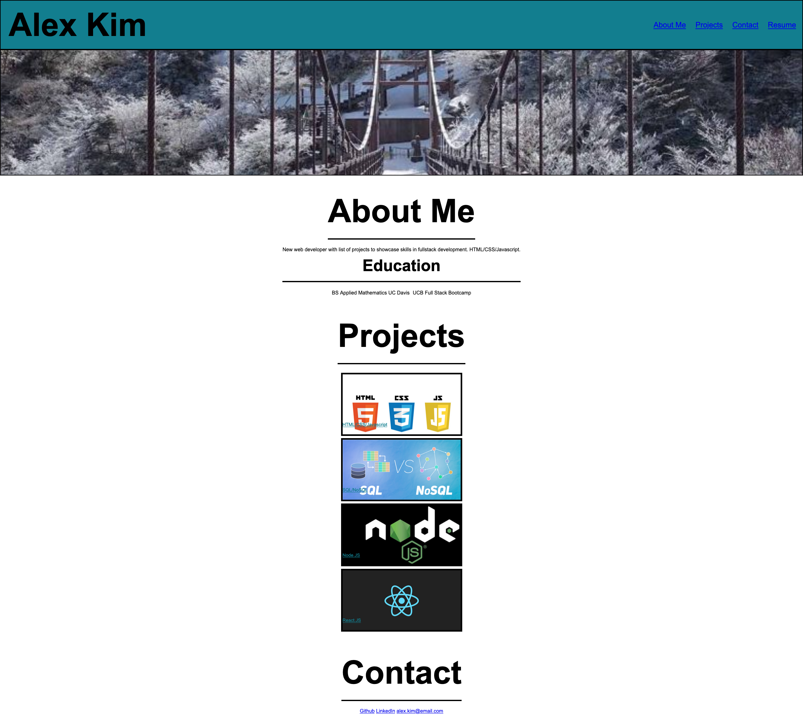

# Project Name - change to the name of your project
​
## Table of contents
​
- [Overview](#overview)
  - [The challenge](#the-challenge)
  - [User Story](#user-story)
  - [Acceptance Criteria](#acceptance-criteria)
  - [Screenshot](#screenshot)
  - [Links](#links)
- [My process](#my-process)
  - [Built with](#built-with)
  - [What I learned](#what-i-learned)
  - [Continued development](#continued-development)
- [Acknowledgments](#acknowledgments)
​
​
## Overview
​
First homework

### The challenge
​
Create a bio website with projects using html and css
​
### User Story
​
Make website accessible to all. 
​
### Acceptance Criteria
​
WHEN I load their portfolio
THEN I am presented with the developer's name, a recent photo or avatar, and links to sections about them, their work, and how to contact them

WHEN I click one of the links in the navigation
THEN the UI scrolls to the corresponding section

WHEN I click on the link to the section about their work
THEN the UI scrolls to a section with titled images of the developer's applications

WHEN I am presented with the developer's first application
THEN that application's image should be larger in size than the others

WHEN I click on the images of the applications
THEN I am taken to that deployed application

WHEN I resize the page or view the site on various screens and devices
THEN I am presented with a responsive layout that adapts to my viewport
​
### Screenshot
​

​
​
### Links
​
- Live Site URL: https://kji00.github.io/homework-2
​
## My process

Followed the acceptance criteria for the homework assignment
​
### Built with
​
- Semantic HTML5 markup
- CSS
- VS Code
​
### What I learned
​
learned about ​advanced CSS such as variables and flexbox
​
### Continued development
​
Some of the code is too WET need to make it more DRY, needc to work on flexbox
​
​
## Acknowledgments

